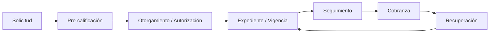

# Ciclo de Vida del Crédito

La aplicación **Crediat** gestiona todo el ciclo de vida del crédito de los clientes, desde la
solicitud hasta la recuperación. Este documento describe los módulos implementados, su estado
actual y el plan de evolución.

## Visión del ciclo de vida

## Estado de implementación

| Fase | Módulo                                    | Estado                                             |
| ---- | ----------------------------------------- | -------------------------------------------------- |
| 1    | **Workflow de Solicitud**                 | ✅ Implementado                                    |
| 2    | **Pre-calificación**                      | ✅ Implementado                                    |
| 3    | **Otorgamiento + Autorización**           | ✅ Implementado                                    |
| 4    | **Expediente + Vigencia + Alertas**       | ✅ Implementado                                    |
| 5    | **Integración (reportes)**                | ✅ Implementado                                    |
| 6    | **Seguimiento / Cobranza / Recuperación** | 🟡 Parcial (bandeja, deudores, facturas, KPIs, IA) |

## Módulos implementados

### Fase 1 — Workflow de Solicitud ✅

- Modelo de estatus con transiciones válidas:
  `solicitud_enviada → en_revision → precalificada → aprobada | rechazada`.
- Vista de detalle de solicitud con documentos adjuntos (MinIO).
- Acciones por estatus (mover a siguiente etapa, rechazo con motivo obligatorio).
- Audit trail de los cambios de estatus.
- Endpoints: `GET/POST /api/credit/applications`, `GET/PATCH /api/credit/applications/[id]`.

### Fase 2 — Pre-calificación ✅

- Modelo `prequalification` (score 0-100, resultado: aprobado / condicionado / rechazado).
- Cálculo de score desde datos (RFC, ingreso, monto, antigüedad).
- Reglas configurables vía variables de entorno (`PREQUAL_*`).
- Integración con validación fiscal SAT (`/api/credit/rfc-validate`).
- UI de pre-calificación en el detalle de la solicitud.
- Endpoint: `POST /api/credit/prequalify`.

### Fase 3 — Otorgamiento de crédito con flujos de autorización ✅

- Modelo `credit_account` (monto, plazo, tasa, condiciones) y `credit_approvals`.
- Flujo de autorización multinivel por roles y jerarquía.
- Reglas de monto de autorización por nivel:
  - Nivel 1: cobrador (hasta $100k)
  - Nivel 2: supervisor (hasta $500k)
  - Nivel 3: admin (sin límite)
- Registro del crédito otorgado con numeración (`CR-YYYY-XXXXX`).
- Notificaciones por email al solicitante (creación, autorización, rechazo).
- UI: `/credit/grant`.
- Endpoints: `POST/GET /api/credit/accounts`, `GET/POST /api/credit/accounts/[id]/approvals/[approvalId]`.

### Fase 4 — Expediente de crédito (vigencia y renovación) ✅

- Modelo `expediente_documentos` con tipo, archivo (MinIO), fechas de emisión/expiración y vigencia.
- Estados de vigencia: `vigente` / `por_vencer` / `vencido`.
- Carga de documentos con fecha de emisión y expiración (INE, RFC, CURP, acta, estados de cuenta, etc.).
- Alertas de vigencia configurable (`EXPEDIENTE_WARNING_DAYS`).
- Notificaciones por email de documentos por vencer/vencidos.
- Dashboard de alertas con enlace a renovación.
- UI: `/credit/expedientes/[accountId]` y `/credit/alertas`.
- Endpoints: `GET/POST /api/credit/expedientes/[accountId]`, `GET /api/credit/expedientes/alertas`.

### Fase 5 — Integración y reportes ✅

- Relación del crédito con el deudor SAP (CardCode).
- KPIs del ciclo de crédito (solicitudes, pre-calificadas, autorizadas, activas, rechazadas, montos, aprobaciones pendientes, documentos por vencer).
- Reporte del ciclo completo (solicitud → otorgado → cobrado).
- UI: `/credit/report`.
- Endpoint: `GET /api/credit/report`.

## Módulos de UI

| Módulo                  | Ruta                               | Acceso            |
| ----------------------- | ---------------------------------- | ----------------- |
| Solicitudes de Crédito  | `/credit/applications` (+ detalle) | Admin, Supervisor |
| Otorgamiento de Crédito | `/credit/grant`                    | Admin, Supervisor |
| Expediente de Crédito   | `/credit/expedientes/[accountId]`  | Admin, Supervisor |
| Reporte de Crédito      | `/credit/report`                   | Admin, Supervisor |
| Alertas de Expediente   | `/credit/alertas`                  | Admin, Supervisor |
| Formulario público      | `/credit/apply`                    | Público           |

## Persistencia

Tablas en PostgreSQL (creadas por `src/lib/db/index.ts`):

- `credit_applications` — solicitudes de crédito.
- `prequalifications` — resultados de pre-calificación.
- `credit_accounts` — cuentas de crédito otorgadas.
- `credit_approvals` — niveles de autorización.
- `expediente_documentos` — documentos del expediente con vigencia.

## Notificaciones por email

Módulo `src/lib/notifications/email.ts` (Brevo):

- `notifyCreditAccountCreated` — solicitud en revisión.
- `notifyCreditAuthorized` — crédito autorizado.
- `notifyCreditRejected` — crédito rechazado (con motivo).
- `notifyDocumentExpiring` — documento por vencer/vencido.

> Si `BREVO_API_KEY` no está configurada, las notificaciones se simulan (retornan éxito sin enviar).

## Pendientes / evolución

- **Seguimiento / Cobranza / Recuperación**: enlazar el crédito otorgado con la bandeja de
  interacciones, deudores, facturas y promesas (módulos ya existentes).
- **Dashboard de alertas global** con notificaciones programadas (job periódico).
- **Validación de RFC** con proveedor fiscal externo configurable (`RFC_VALIDATION_API_URL`).

## Configuración relevante

| Variable                                    | Uso                                        |
| ------------------------------------------- | ------------------------------------------ |
| `PREQUAL_MIN_SCORE`                         | Score mínimo para aprobar pre-calificación |
| `PREQUAL_MAX_DEBT_TO_INCOME`                | Ratio máximo deuda/ingreso                 |
| `PREQUAL_MIN_AMOUNT` / `PREQUAL_MAX_AMOUNT` | Rango de monto solicitado                  |
| `PREQUAL_MIN_BUSINESS_AGE`                  | Antigüedad mínima del negocio (moral)      |
| `EXPEDIENTE_WARNING_DAYS`                   | Días antes de la expiración para alertar   |
| `RFC_VALIDATION_API_URL`                    | Proveedor de validación fiscal (opcional)  |
| `BREVO_API_KEY`                             | Email transaccional                        |
