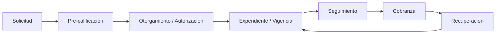

# Plan: Ciclo de Vida del Crédito

La aplicación **Crediat** gestiona todo el ciclo de vida del crédito de los clientes, desde la
solicitud hasta la recuperación. Este documento estructura los módulos requeridos y define el
orden lógico de implementación.

## Visión del ciclo de vida

## Módulos requeridos (mapeo al estado actual)

| Fase | Módulo                      | Estado actual                                   | Requerido                                 |
| ---- | --------------------------- | ----------------------------------------------- | ----------------------------------------- |
| 1    | **Solicitud de crédito**    | ✅ Parcial (formulario + listado + RFC + MinIO) | Completar workflow de estatus             |
| 2    | **Pre-calificación**        | ❌ No existe                                    | Nuevo                                     |
| 3    | **Otorgamiento de crédito** | ❌ No existe                                    | Nuevo (incluye flujos de autorización)    |
| 4    | **Gestión de expendientes** | ❌ No existe                                    | Nuevo (documentos por cliente + vigencia) |
| 5    | **Seguimiento**             | 🟡 Parcial (bandeja/interacciones)              | Enlazar al crédito                        |
| 6    | **Cobranza**                | 🟡 Parcial (deudores, facturas, promesas)       | Enlazar al crédito                        |
| 7    | **Recuperación**            | 🟡 Parcial (KPIs, IA)                           | Enlazar al crédito                        |

## Plan de implementación por fases (orden lógico)

### Fase 1 — Completar workflow de Solicitud

**Objetivo:** consolidar el módulo actual como base del ciclo.

- [ ] Definir modelo de estatus/etapas de la solicitud (`solicitud_enviada`, `en_revision`, `precalificada`, `aprobada`, `rechazada`).
- [ ] Vista de detalle de solicitud (`/credit/applications/[id]`) con documentos adjuntos (desde MinIO).
- [ ] Acciones por estatus (iniciar pre-calificación, rechazar con motivo, etc.).
- [ ] Audit trail completo de la solicitud.

### Fase 2 — Pre-calificación

**Objetivo:** evaluar de forma preliminar la viabilidad del crédito antes del otorgamiento.

- [ ] Modelo `prequalification` (score preliminar, resultado: aprobado / condicionado / rechazado).
- [ ] Cálculo de score a partir de datos (RFC vigente, historial, límites, ingresos declarados).
- [ ] Reglas de pre-calificación configurables (montos mín/max, ratios deuda/ingreso, antigüedad).
- [ ] Integración con validación fiscal (SAT) existente (`/api/credit/rfc-validate`).
- [ ] UI de pre-calificación por solicitud + listado.

### Fase 3 — Otorgamiento de crédito con flujos de autorización

**Objetivo:** autorizar el monto, plazo y condiciones del crédito mediante aprobaciones.

- [ ] Modelo `credit_account` / `credit_grant` (monto, plazo, tasa, condiciones).
- [ ] Flujo de autorización multinivel (ej. cobrador → supervisor → dirección), con roles y jerarquía.
- [ ] Tabla de `approvals` (nivel, aprobador, decisión, comentarios, fecha).
- [ ] Reglas de monto de autorización por nivel (quién aprueba según monto).
- [ ] Registro del crédito otorgado y generación de numeración/contrato.
- [ ] Notificación (email) al cliente y a los aprobadores.

### Fase 4 — Gestión de expendiente de crédito (vigencia y renovación)

**Objetivo:** almacenar y dar seguimiento a los documentos del cliente con crédito otorgado,
controlando su vigencia para renovación.

- [ ] Modelo `expediente_documento` + `expediente_vigencia`.
- [ ] Carga de documentos (MinIO) con fecha de emisión y de expiración (INE, RFC, CURP, acta constitutiva, estados de cuenta, etc.).
- [ ] Módulo de listado por cliente (`/credit/expedientes`) con estado del documento (vigente / por vencer / vencido).
- [ ] **Alertas de vigencia**: notificar N días antes de la expiración (configurable) y marcar vencidos.
- [ ] Workflow de renovación (subir documento actualizado, re-validar).
- [ ] Dashboard de alertas (documentos por vencer/vencidos) y notificaciones (email/bandeja).

### Fase 5 — Integración con el resto del ciclo

**Objetivo:** enlazar el crédito otorgado con seguimiento, cobranza y recuperación.

- [ ] Relacionar el crédito con el deudor SAP (CardCode), facturas, e interacciones.
- [ ] KPIs por crédito/cliente (saldo, pagos, morosidad).
- [ ] Vinculación con IA (analítica, generación de mensajes de cobranza).
- [ ] Reportes del ciclo completo (solicitud → otorgado → cobrado).

## Orden de prioridad recomendado

1. **Fase 1** (workflow de solicitud) — base de todo.
2. **Fase 4** (expedientes + vigencia + alertas) — soporta otorgamiento y renovación.
3. **Fase 2** (pre-calificación) — da valor previo al otorgamiento.
4. **Fase 3** (otorgamiento + autorización) — cierra el ciclo de forma controlada.
5. **Fase 5** (integración) — completa el panorama.

> **Nota de orden:** aunque la `solicitud → pre-calificación → otorgamiento` es el flujo natural,
> se recomienda implementar la **Fase 4 (expedientes)** temprano porque los documentos ya se
> capturan en la solicitud y la vigencia es crítica para la renovación.
> La **Fase 3 (autorizaciones)** requiere un modelo de roles robusto que conviene asentar antes
> de otros flujos transaccionales.
